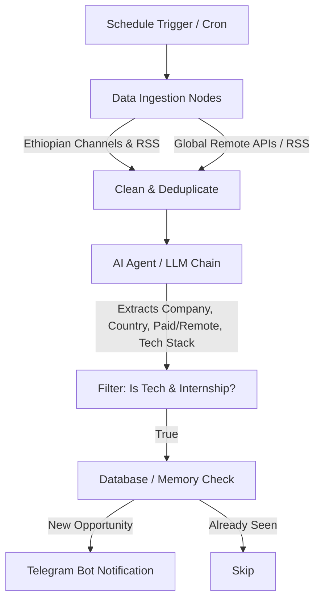

# InternOrbit 🛰️
> **Automated AI-Powered Tech Internship Radar for Software Engineering Students**

InternOrbit is an intelligent automation system built with **n8n** and **Generative AI** that aggregates, filters, parses, and sends notifications for tech internships in Ethiopia and worldwide (Remote/On-site) straight to your Telegram.

---

## 🎯 Key Features
- 🔍 **Multi-Source Ingestion**: Monitors Ethiopian job portals/Telegram channels and global remote job boards.
- 🤖 **AI-Powered Evaluation**: Analyzes job descriptions using LLMs (Google Gemini 1.5/2.0 Flash or OpenAI) to extract:
  - Company Name & Country
  - Work Mode (Remote / On-site / Hybrid)
  - Compensation (Paid vs Unpaid stipend details)
  - Key Tech Stack (e.g., React, Python, Flutter, Go, etc.)
  - Direct Application Link
- 🎯 **Targeted Filtering**: Filters out non-tech and senior roles; focuses strictly on internships, apprenticeships, and junior roles.
- 📲 **Instant Telegram Alerts**: Delivers rich markdown alerts with direct 1-click apply links.
- 🔄 **Deduplication**: Ensures you never receive duplicate notifications for the same job.

---

## 🏗️ Architecture Overview



---

## 🚀 Quick Start (Local n8n Setup)

### 1. Start n8n with Docker Compose
Run the following command in this directory:
```bash
docker compose up -d
```
Then open your browser and navigate to:
```
http://localhost:5678
```

### 2. Import the Workflow
1. In n8n, click **Workflows** -> **Import from File...**
2. Select [`internorbit_n8n_workflow.json`](./internorbit_n8n_workflow.json).

### 3. Configure Credentials
1. **Telegram API**:
   - Talk to [@BotFather](https://t.me/BotFather) on Telegram to create a bot and get your `Bot Token`.
   - Talk to [@userinfobot](https://t.me/userinfobot) to get your personal `Chat ID`.
2. **Google Gemini API Key**:
   - Grab a free key from [Google AI Studio](https://aistudio.google.com/).
   - Add it under n8n Credentials -> **Google PaLM/Gemini API**.
