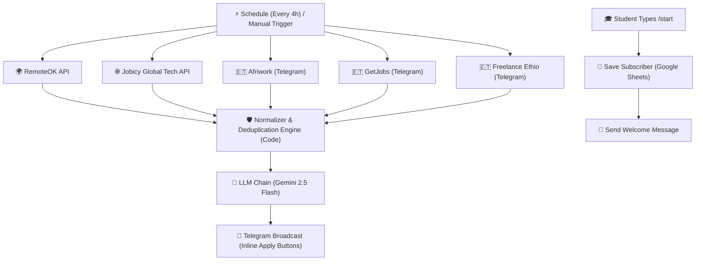

# InternOrbit 🛰️
> **Automated Multi-Source AI Tech Internship Radar for Software Engineering Students**

[](https://github.com/yared2124/InternOrbit/actions/workflows/ci.yml)
[](https://opensource.org/licenses/MIT)
[](https://n8n.io)
[](https://aistudio.google.com)

InternOrbit is an intelligent, production-grade automation agent built with **n8n** and **Generative AI (Google Gemini 2.5 Flash)**. It continuously monitors, aggregates, filters, deduplicates, and broadcasts student tech internships from verified global remote APIs and local Ethiopian channels directly to Telegram with interactive 1-click apply buttons.

---

## 🎯 Production Architecture & Features

- 🌐 **Multi-Source Ingestion Pipeline**:
  - **RemoteOK API**: Global remote software and tech opportunities.
  - **Jobicy Global Tech API**: Worldwide remote internships, junior engineers, and apprenticeships.
  - **Ethiopian Tech Channels**: Real-time domestic opportunities from curated channels (**Afriwork**, **GetJobs**, **Freelance Ethio**) with direct post resolution.
- 🛡️ **Fault-Tolerant Execution**:
  - Configured with `continueOnFail` and browser header emulation so downtime or rate limits from one source never halt the pipeline.
- 🔁 **Cross-Execution Deduplication Engine**:
  - Maintains persistent state (`$getWorkflowStaticData('global')`) across scheduled runs.
  - Eliminates duplicate alerts by tracking processed URLs and titles, ensuring students never receive repeated postings.
- 🤖 **Bilingual AI Filtering & Extraction (Gemini 2.5 Flash)**:
  - **Strict Student Filter**: Discards non-engineering roles, senior positions, and graduate programs.
  - **Amharic & English Parsing**: Automatically translates domestic Amharic announcements into structured technical summaries.
  - **Key Metadata Extraction**: Deadline urgency detection, tech stack extraction, compensation, and 2-bullet concise scope summaries.
- 📲 **Interactive Telegram Alerts**:
  - Formatted in clean Markdown with zero emoji clutter.
  - Includes Telegram **Inline Keyboard Buttons**:
    - `[ 🌐 Apply Now ]` — Direct link to the source application page.
    - `[ 📢 Share Alert ]` — Instant forwarding to fellow student groups.
  - Supports configurable destination via `$env.TELEGRAM_CHAT_ID` (broadcast channel or private direct message).
- 🎓 **Student Onboarding (`/start`)**:
  - Captures student subscriptions and delivers an instant welcome overview.

---

## 🏗️ Architecture Pipeline



---

## 🧪 Automated Testing & CI/CD Pipeline

InternOrbit includes an automated quality assurance suite that executes on every push and runs daily at 06:00 UTC:

```bash
# Run local pipeline validation and API health checks
python3 tests/validate_pipeline.py
```

The CI checks:
1. Complete JSON structural validity and node integrity of `internorbit_n8n_workflow.json`.
2. Live ping and response validation against RemoteOK and Jobicy Global APIs.

---

## 🚀 How to Run in n8n Cloud / Self-Hosted

### 1. Import the Workflow
1. Open your n8n instance (Cloud or Docker).
2. Navigate to **Workflows** -> **Import from File...**
3. Select [`internorbit_n8n_workflow.json`](./internorbit_n8n_workflow.json).

### 2. Configure Credentials
- **Google Gemini API**: Add your free API key from [Google AI Studio](https://aistudio.google.com/) (`models/gemini-2.5-flash`).
- **Telegram API**: Connect your bot token from [@BotFather](https://t.me/BotFather).
- **Google Sheets (Optional)**: Connect your Google account if tracking subscribers via the `/start` flow.

### 3. Configure Telegram Channel / Group
- To post alerts into a public or private student channel:
  1. Add your bot as an **Administrator** in your Telegram Channel.
  2. Set your environment variable `TELEGRAM_CHAT_ID=@your_channel_username` (or your channel/chat numeric ID).
  3. Toggle **"Publish"** on the top right in n8n to enable 24/7 background autopilot!

---

## 📂 Project Structure

```text
InternOrbit/
├── .github/workflows/ci.yml       # GitHub Actions CI pipeline & daily health check
├── tests/validate_pipeline.py     # Automated test suite for workflow schema & APIs
├── internorbit_n8n_workflow.json  # Production n8n workflow with dedup & multi-source engine
├── docker-compose.yml             # Self-hosted n8n container runner
├── .env.example                   # Environment configuration template
├── .gitignore                     # Git ignore rules
└── README.md                      # Complete system documentation
```

---

## ⚙️ Environment Variables (`.env`)

| Variable | Description | Default / Example |
| :--- | :--- | :--- |
| `TELEGRAM_BOT_TOKEN` | Bot API Token from @BotFather | `123456789:ABC...` |
| `TELEGRAM_CHAT_ID` | Telegram Channel username or chat ID | `@InternOrbit_Channel` |
| `GEMINI_API_KEY` | Google Gemini API Key | `AIzaSy...` |
| `GEMINI_MODEL` | Gemini Model identifier | `models/gemini-2.5-flash` |
| `N8N_PORT` | Local n8n server port | `5678` |
| `GENERIC_TIMEZONE` | Automation scheduling timezone | `Africa/Addis_Ababa` |
