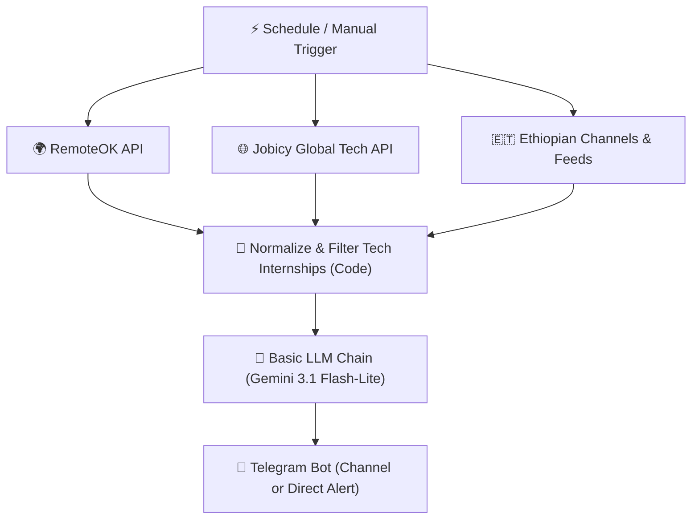

# InternOrbit 🛰️
> **Automated Multi-Source AI Tech Internship Radar for Software Engineering Students**

InternOrbit is an intelligent, production-grade automation agent built with **n8n** and **Generative AI (Google Gemini 3.1 Flash-Lite)**. It aggregates, filters, standardizes, and notifies students about tech internships from multiple global and local sources with deadline tracking, tech stack matching, and 1-click apply links.

---

## 🎯 Key Production Features
- 🌐 **Multi-Source Aggregation**: Fetches opportunities simultaneously from:
  - **RemoteOK API**: Global remote software and tech roles.
  - **Jobicy Global Tech API**: Worldwide remote internships, junior engineers, and apprenticeships.
  - **Ethiopian Tech Telegram Channels**: Curated domestic opportunities (HaHuJobs, Shega, TechJobs).
- 🧹 **Unified Data Normalizer**: Merges heterogeneous sources into a clean schema (`title`, `company`, `location`, `pubDate`, `salary`, `source`, `url`, `description`).
- 🤖 **AI Precision Extraction (Gemini 3.1 Flash-Lite)**:
  - Strict tech relevance validation (filters out HR, sales, nursing, and non-engineering roles).
  - ⏳ **Deadline / Urgency Detection** (identifies application cutoff dates or marks "Apply ASAP").
  - 💻 **Key Tech Stack Extraction** (languages, frameworks, libraries, tools).
  - 📝 **Structured 3-Bullet Summary** focusing on student learning outcomes and daily deliverables.
- 📲 **Telegram Production Alerts**: Delivers rich markdown alerts directly to your private chat or a public student **Telegram Channel/Group**.

---

## 🏗️ Architecture Pipeline



---

## 🚀 How to Run in n8n Cloud / Self-Hosted

1. **Import the Workflow**:
   - Open your n8n instance (e.g. `your-instance.app.n8n.cloud`).
   - Go to **Workflows** -> **Import from File...** -> choose [`internorbit_n8n_workflow.json`](./internorbit_n8n_workflow.json).

2. **Credentials Setup**:
   - **Google Gemini API**: Connect your free Google AI Studio key (`models/gemini-3.1-flash-lite`).
   - **Telegram API**: Connect your Bot Token from [@BotFather](https://t.me/BotFather).

3. **Deploying for Friends & Students (Channel Setup)**:
   - Create a Telegram Channel (e.g., `@InternOrbit_Jobs`).
   - Add your bot as an **Administrator** with permission to post messages.
   - In the Telegram node, set the `Chat ID` to `@your_channel_username` (or keep your private Chat ID).
   - Toggle **"Publish"** on the top right in n8n to enable 24/7 background autopilot!

---

## 📂 Project Structure
```text
InternOrbit/
├── internorbit_n8n_workflow.json  # Production multi-source n8n workflow
├── docker-compose.yml             # Local / Self-hosted n8n runner
├── .env.example                   # Environment configuration template
├── .gitignore                     # Security & secrets protection
└── README.md                      # Complete system documentation
```
